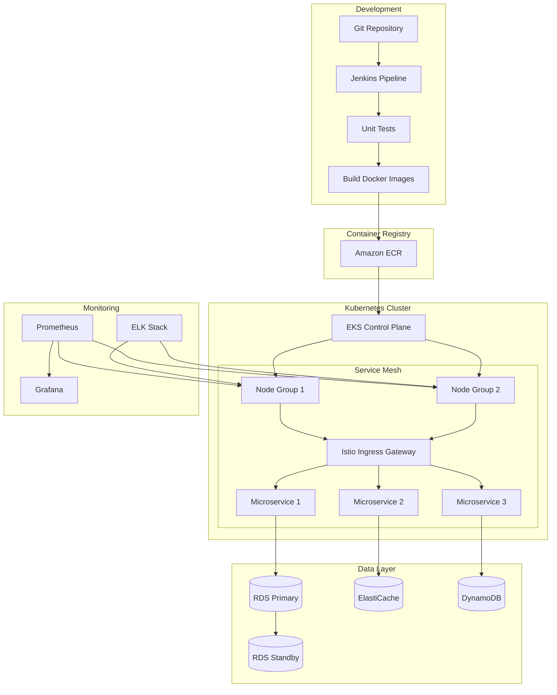
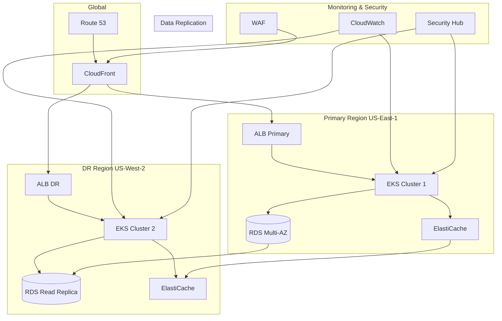
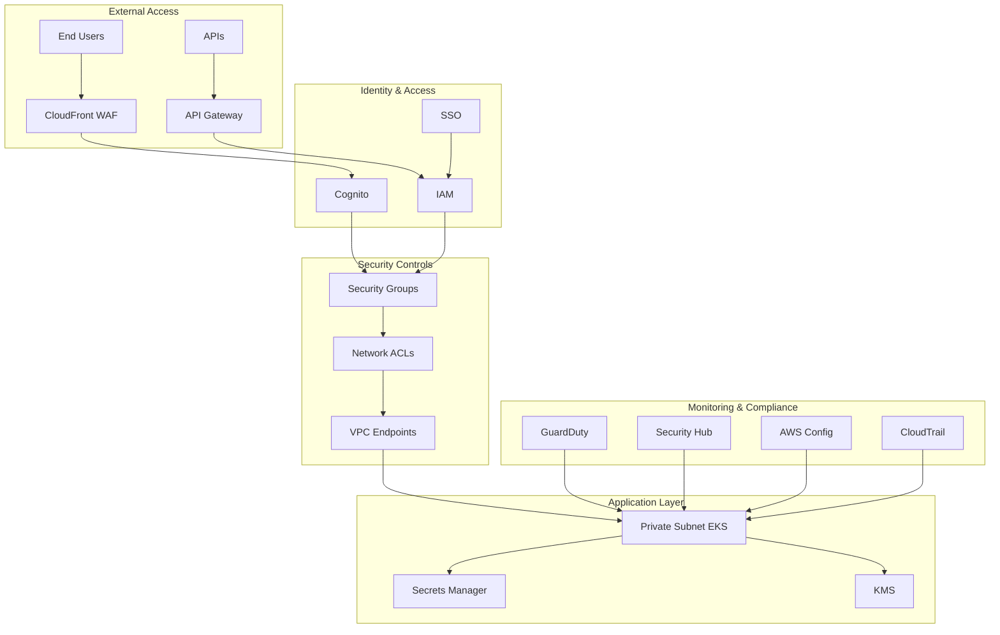

# DevOps Architecture Design Tools and Sample Architectures

## 1. Recommended Architecture Design Tools

### 1.1 Cloud-specific Tools
- **AWS Architecture Center**
  - AWS Well-Architected Tool
  - AWS CloudFormation Designer
  - Features: Built-in best practices, compliance checks, automatic updates

- **Azure Architecture Center**
  - Azure Solution Architect Tools
  - Azure Advisor
  - Features: Cloud-native integration, cost optimization recommendations

### 1.2 Diagramming Tools
- **Draw.io (diagrams.net)**
  - Free, open-source
  - Extensive cloud and DevOps symbol libraries
  - Features: Real-time collaboration, version control integration

- **Lucidchart**
  - Professional diagramming tool
  - Enterprise-grade features
  - Features: Team collaboration, extensive templates

- **Mermaid**
  - Text-based diagramming
  - Git-friendly format
  - Features: Easy version control, code-as-diagram

### 1.3 Infrastructure as Code (IaC) Visualization
- **Terraform Graph**
  - Visual representation of infrastructure
  - Dependency mapping
  - Features: Automated diagram generation from code

- **CloudCraft**
  - 3D visualization of cloud infrastructure
  - Real-time AWS integration
  - Features: Live environment mapping

## 2. Sample Architecture Diagrams

### 2.1 Microservices Architecture with CI/CD Pipeline

### 2.2 High-Availability Multi-Region Architecture

### 2.3 Zero-Trust Security Architecture

## 3. Best Practices for Architecture Design

### 3.1 Tool Selection Criteria
- Integration capabilities with existing tools
- Learning curve and team expertise
- Version control compatibility
- Collaboration features
- Export/import capabilities
- Cost considerations
- Support for cloud-native services

### 3.2 Design Principles
- Use consistent symbols and notations
- Include clear boundaries and zones
- Show security controls explicitly
- Document data flows
- Include monitoring and logging components
- Show disaster recovery elements
- Indicate scaling mechanisms

### 3.3 Documentation Requirements
- Architecture overview
- Component interactions
- Security controls
- Scaling mechanisms
- Disaster recovery procedures
- Compliance mappings
- Cost optimization strategies

## 4. Implementation Guidelines

### 4.1 Version Control
- Store diagrams in Git repositories
- Use text-based formats when possible
- Maintain diagram versioning
- Link diagrams to corresponding code

### 4.2 Review Process
- Regular architecture reviews
- Security reviews
- Cost optimization reviews
- Performance reviews
- Compliance audits

### 4.3 Maintenance
- Update diagrams with infrastructure changes
- Document architecture decisions
- Track technical debt
- Plan for evolution and scaling

## 5. Tool-specific Tips

### 5.1 Draw.io Best Practices
- Use layers for different aspects
- Maintain consistent styling
- Create custom templates
- Use containers for logical grouping

### 5.2 Mermaid Tips
- Break complex diagrams into subgraphs
- Use meaningful node IDs
- Include comments for clarity
- Consider direction (TB, LR, etc.)

### 5.3 CloudCraft Recommendations
- Start with AWS import
- Use layers for different environments
- Document assumptions
- Regular synchronization with live environment

## 6. Conclusion

The choice of architecture design tools should align with your team's needs, technical requirements, and organizational constraints. A combination of tools often provides the most comprehensive solution, allowing for both high-level visual representations and detailed technical specifications.
